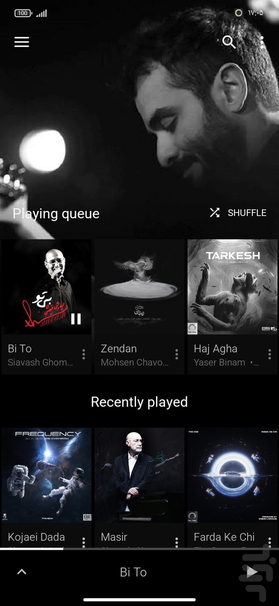
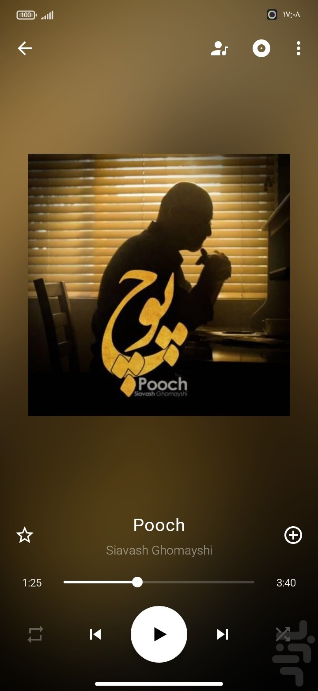
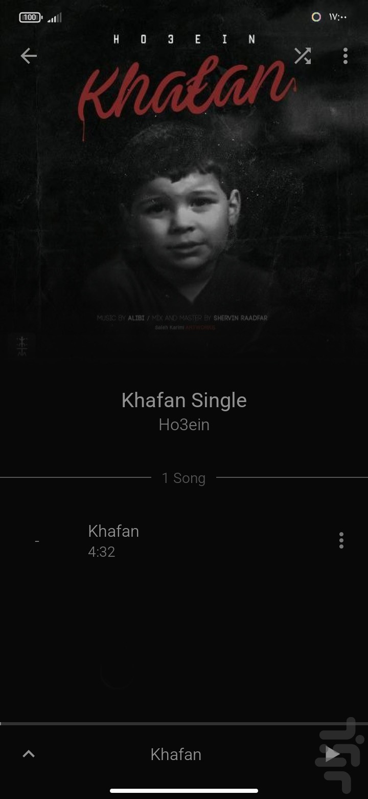

# Musical ​​🎶​

Play your music with musical and use its personalization and attractive features

## Screenshots
|  |  |  |
|:---:|:---:|:---:|
| Home | Player | Album |

## Building from source

Requirements:
- Android Studio (latest stable) or plain Gradle
- JDK 21
- Android SDK with API 36

### Firebase (optional)

Analytics and Crashlytics are only enabled when `app/google-services.json` exists.
The file is not checked into the repository, and the project builds fine without it —
Firebase simply stays disabled.

To enable it, create your own [Firebase project](https://console.firebase.google.com/),
register two Android apps with the package names `github.o4x.m2` and `github.o4x.m2.debug`
(the debug build adds a `.debug` suffix), then download the generated
`google-services.json` into the `app/` directory.

